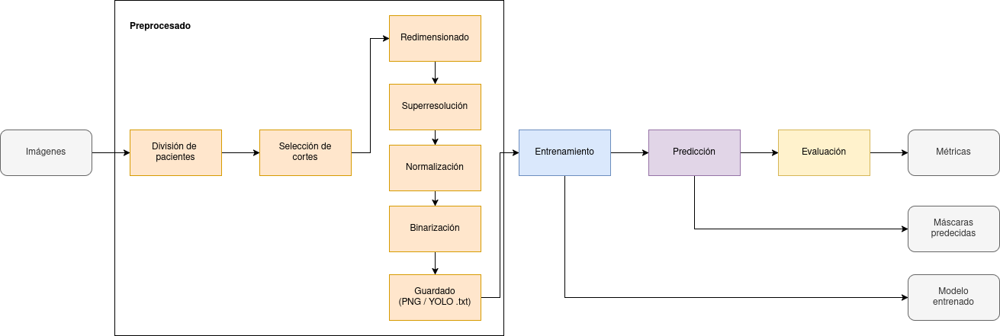
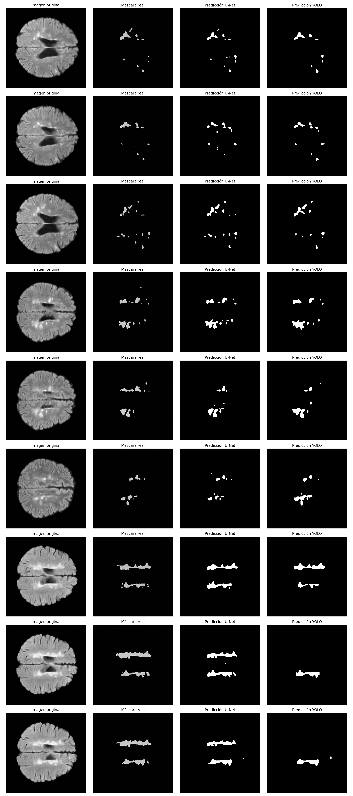

# Automatic System for Semantic Segmentation of Multiple Sclerosis Lesions in MRI
This repository contains the code for the Master's Degree final project: "Semantic Segmentation of Multiple Sclerosis Lesions in Magnetic Resonance Images Enhanced by Super-Resolution" by **Samuel Sánchez Toca**.

# Table of Contents
- [Automatic System for Semantic Segmentation of Multiple Sclerosis Lesions in MRI](#automatic-system-for-semantic-segmentation-of-multiple-sclerosis-lesions-in-mri)
  - [Table of Contents](#table-of-contents)
  - [Description](#description)
  - [Features](#features)
  - [Architecture](#architecture)
  - [Installation](#installation)
  - [Usage](#usage)
  - [License](#license)

# Description
This project implements a system for the semantic segmentation of multiple sclerosis lesions in MRI scans. It utilizes deep learning techniques, particularly convolutional neural networks (CNNs), to achieve high accuracy in lesion detection and segmentation.

It includes:
- FSRCNN: A super-resolution model to enhance MRI images.
- U-Net: A deep learning architecture for semantic segmentation.
- YOLOv11: A real-time object detection model adapted for lesion detection.

# Features
- End-to-end pipeline for training and evaluation
- Preprocessing modules with slice selection and super-resolution
- Support for U-Net and YOLOv11 architectures
- K-Fold cross-validation
- Comprehensive evaluation with Dice, IoU, Precision, and Recall

# Architecture
The system follows this pipeline:

MRI Volume → Slice Selection → Preprocessing → Super-Resolution (FSRCNN) → Model (U-Net / YOLOv11) → Postprocessing → Evaluation



# Installation
To set up the project, follow these steps:
1. Clone the repository:

2. Create a virtual environment (optional but recommended):
   ```bash
   python -m venv venv
   source venv/bin/activate  # On Windows use `venv\Scripts\activate`
   ```
3. Install the required dependencies:
   ```bash
   pip install -r requirements.txt
   ```
# Usage
To use the system, follow these steps:
1. Use the dataset from the [ICPR 2024 Competition on Multiple Sclerosis Lesion Segmentation](https://iplab.dmi.unict.it/mfs/ms-les-seg/).

2. Run the script (self explanatory):
   ```bash
   python main.py
    ```

## Configuration
The pipeline is controlled by a JSON configuration file.  
At the top level, the file must contain an `"experiments"` array, where each element describes one experiment with its preprocessing, training, prediction, and evaluation steps.

### Example structure

```json
{
  "experiments": [
    {
      "id": "A",
      "preprocess": { ... },
      "train": { ... },
      "predict": { ... },
      "evaluate": { ... }
    }
  ]
}
```

## Parameters

### id
- **Type**: `string`
- **Description**: Unique identifier for the experiment (e.g., `"A"`, `"B1"`).
- **Usage**: Used to label outputs and logs.

### preprocess
Prepares raw MRI data into a dataset suitable for training.

- **net**  
   - **Type**: `string` (`"unet"` | `"yolo"`)  
   - **Description**: Target network to format data for.

- **src_path**  
   - **Type**: `string` (path)  
   - **Description**: Location of raw input data.

- **dst_path**  
   - **Type**: `string` (path)  
   - **Description**: Destination folder for processed dataset.

- **resize**  
   - **Type**: `[width, height]`  
   - **Description**: Final image size for slices.

- **seed**  
   - **Type**: `int`  
   - **Description**: Random seed for reproducibility.

- **split**  
   - **Type**: `float` (0–1)  
   - **Description**: Fraction of patients assigned to training set. Remaining are used for validation/test.

- **strategy**  
   - **Type**: `string`  
   - **Description**: Slice selection strategy:  
      - `"all_slices"`: Use all slices.  
      - `"lesion_slices"`: Only slices with visible lesion.  
      - `"lesion_block"`: Block of slices centered on largest lesion.  
      - `"brain_slices"`: Only slices containing brain tissue.

- **super_scale**  
   - **Type**: `int`  
   - **Description**: Super-resolution factor (1 = none, 2 = 2× upscaling, etc.).

- **kfold**  
   - **Type**: `object`  
   - **Description**: If given, preprocess step will save for each fold train and val images for later steps.  
      - **enable**: `bool`, whether to use k-fold.  
      - **n_splits**: `int`, number of folds.  
      - **seed**: `int`, random seed for splitting.  
      - **mini_val_frac**: `float`, fraction of training fold held out as validation.  
      - **link_mode**: `"copy"` or `"hardlink"`, how files are referenced.

### train
Controls training procedure.

- **net**  
   - **Type**: `string`  
   - **Description**: Must match `preprocess.net`.

- **src_path**  
   - **Type**: `string` (path)  
   - **Description**: Processed dataset to train from.

- **dst_path**  
   - **Type**: `string` (path)  
   - **Description**: Where to save training outputs (logs, checkpoints).

- **batch_size**  
   - **Type**: `int`  
   - **Description**: Number of slices per training step.

- **use_kfold**  
   - **Type**: `bool`  
   - **Description**: Whether to train across folds instead of a single split.

- **epochs**  
   - **Type**: `int`  
   - **Description**: Number of full passes over training data.

- **learning_rate**  
   - **Type**: `float`  
   - **Description**: Initial learning rate.

### predict
Runs inference on new data.

- **net**  
   - **Type**: `string`  
   - **Description**: Must match `train.net`.

- **model_path**  
   - **Type**: `string` (path)  
   - **Description**: Path to trained model checkpoint.

- **src_path**  
   - **Type**: `string` (path)  
   - **Description**: Data to predict on.

- **dst_path**  
   - **Type**: `string` (path)  
   - **Description**: Where predicted masks will be written.

### evaluate
Evaluates predictions against ground truth.

- **net**  
   - **Type**: `string`  
   - **Description**: Must match `train.net`.

- **model_path**  
   - **Type**: `string` (path)  
   - **Description**: Path to trained model checkpoint.

- **src_path**  
   - **Type**: `string` (path)  
   - **Description**: Dataset used for evaluation.

- **pred_path**  
   - **Type**: `string` (path)  
   - **Description**: Predictions to evaluate.

- **gt_path**  
   - **Type**: `string` (path)  
   - **Description**: Ground truth labels.


# Examples
The following images illustrate the results of the segmentation process:


From left to right: 
- Original MRI image
- Original lesion mask
- U-Net segmentation result
- YOLOv11 segmentation result

# License
This project is licensed under the MIT License. See the [LICENSE](LICENSE) file for details.